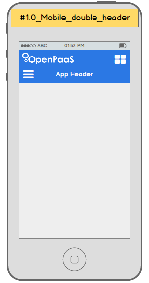
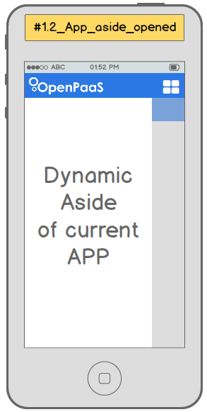

We have some specific rules for each mobile templates to keep consistency and ease OpenPaas usage by an end user. Fortunately we created a bunch of helpers.

### What do it looks like?

Every views including in a OpenPaas module will look like this:



As you can see, we have 2 headers:

* The very top header (with the openpaas logo) is composed by the logo and the application grid button.

This header is automatically included in each pages. Also on **scroll down** this header will disappear and the second header will take the place. We are doing it to gain more space.

* The second header is special, it is compiled using the [dynamic-directive](https://github.com/linagora/dynamic-directive) module. It allows us to compile a different header for each view with actions depending on the scope or the application and current view context.

* Finally a right aside will be used to enhanced the interaction possible in the view.



The whole grey background is now the content of the view.

### The subheader system

To use the subheader system, your new module will have to include the **esn.header** module, exposing itself a **headerService**.

```javascript
angular.module('your.new.module', ['esn.header']);
```

Now in each controllers of each views you have to:

* create a the directives holding the header template:

```javascript
.directive('mymoduleHeaderMobile', function() {
  return {
    restrict: 'E',
    replace: true,
    templateUrl: '/mymodule/views/mymodule/mymodule-header-mobile.html'
  };
})

.directive('mymoduleHeaderContent', function() {
  return {
    restrict: 'E',
    replace: true,
    template: '<span>My Module</span>'
  };
})
```

* inject the header template you want with (**Do not forget to remove the header on $destroy**):

```javascript
angular.module('your.new.module', ['esn.header'])
  .controller('myController1', function($scope, headerService) {
    headerService.mainHeader.addInjection('mymodule-header-content');
    headerService.subHeader.addInjection('mymodule-header-mobile', $scope);

    $scope.on('$destroy', function() {
      headerService.resetAllInjections();
    });
  });
```

### The aside system

This one is simpler than the subheader. First include **esn.sidebar** in your module:

```javascript
angular.module('your.new.module', ['esn.sidebar']);
```

Then in any template, use the new **contextual-sidebar** directive like so:

```jade
a(href='', contextual-sidebar, data-content-template="/mymodule/views/mymodule/mymodule-sidebar")
```

It will bind the element on *click* and open a right sidebar compiled with the given template.
