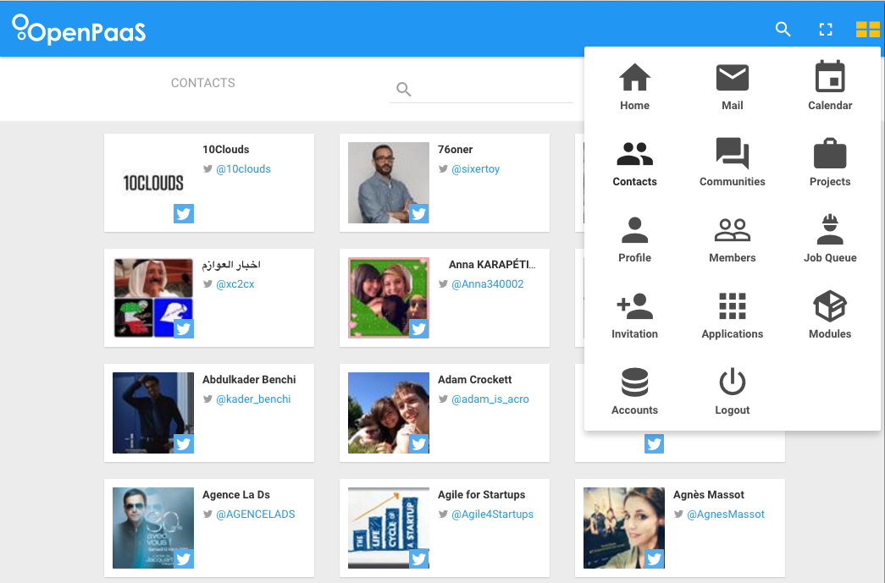

OpenPaaS is built to be modular, just because this is an extensible platform. In the [first Tip](http://linagora.github.io/openpaas-tip-of-the-day/create-a-new-module/), we introduced the AwesomeModule system we developed to be modular on the backend side. Today, we are going to focus on how to be modular on the frontend side.

### Getting started

Once angularjs and the dynamic-directive module are available in your project, you can start to inject directives on defined anchor points:

```javascript
angular.module('your-app', ['op.dynamicDirective'])
.directive('dir1', function() {
  return {
    restrict: 'E',
    template: '<div>Item X</div>'
  };
})
.directive('dir2', function() {
  return {
    restrict: 'E',
    template: '<div>Item Y</div>'
  };
})
.directive('addButton', ['dynamicDirectiveService', function(dynamicDirectiveService) {
  return {
    restrict: 'A',
    link: funtion(scope) {
      var dir2 = new dynamicDirectiveService.DynamicDirective(
        function(scope) {return true;},
        'dir2'
      );
      scope.add = function() {
        dynamicDirectiveService.addInjection('anchorPoint1', dir2);
      };
    }
  };
});
;
```

```html
<body ng-app='your-app'>
  <div class='items' dynamic-directive='anchorPoint1'>
    <dir1></dir1>
  </div>
  <div>
    <button add-button ng-click='add()'>Dynamically add the dir2 directive</button>
  </div>
</body>
```

As you may understand, everytime the user clicks on the button, a new directive is injected in the div element with the anchorPoint1 dynamic-directive attribute.

### How we use it?

The dynamic directives are used at several places in the OpenPaaS Web UI. As the core backend module allows to plug backend modules, every plugged module can then push their directives into the core Web UI to enrish it.

As an example, the application menu is built just like this. Here is the core application menu anchor declaration:

```jade
.popover.application-menu(dynamic-directive='esn-application-menu', force-close-on-links-click, force-margin-left="10")
```

Where the 'esn-application-menu' is the anchor name where dynamic directives can be plugged. That's all. Up to anyone to say that he wants to add elements to this one.

Each module can then push an application menu item, which use the dynamic-directive service. Here is a simple directive which defines the icon to be added to the menu:

```javascript
angular.module('linagora.esn.contact')
  .directive('applicationMenuContact', function(applicationMenuTemplateBuilder) {
    return {
      retrict: 'E',
      replace: true,
      template: applicationMenuTemplateBuilder('/#/contact', 'mdi-account-multiple', 'Contacts')
    };
  });
```
Note that applicationMenuTemplateBuilder is just a factory to build a valid HTML element based on the href, icon class and title. And so now the module can inject its menu item like this:

```js
angular.module('linagora.esn.contact', ['op.dynamicDirective'])
.config(function(dynamicDirectiveServiceProvider) {
  var contact = new dynamicDirectiveServiceProvider.DynamicDirective(true, 'application-menu-contact', {priority: 35});
  dynamicDirectiveServiceProvider.addInjection('esn-application-menu', contact);
});
```

As a result, every item of the menu above is injected using dynamic-directive, just because each item drives the user to a module which injects the directive at the right place.



This is a quite easy example on how we use it. We also use it to build headers on mobile, add options on dropdowns, add items on asides, ... Well, everywhere in fact.

### Wanna hack?

You can find more information about the [dynamic-directive module here] (https://github.com/linagora/dynamic-directive)

Cheers!
